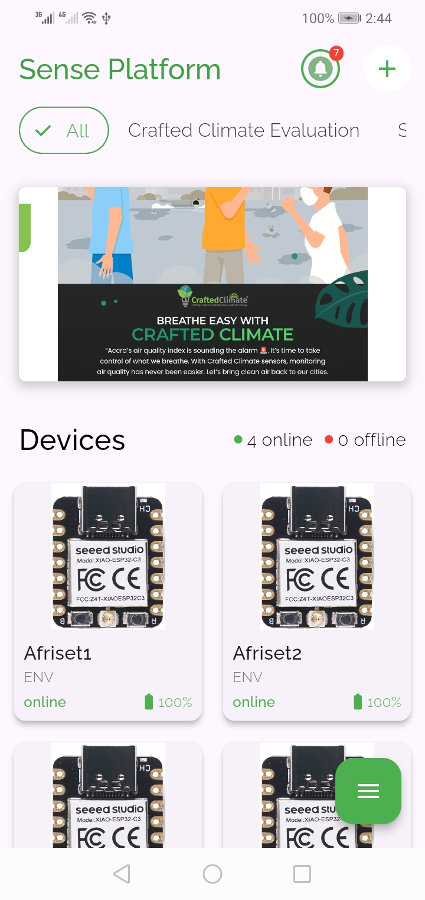
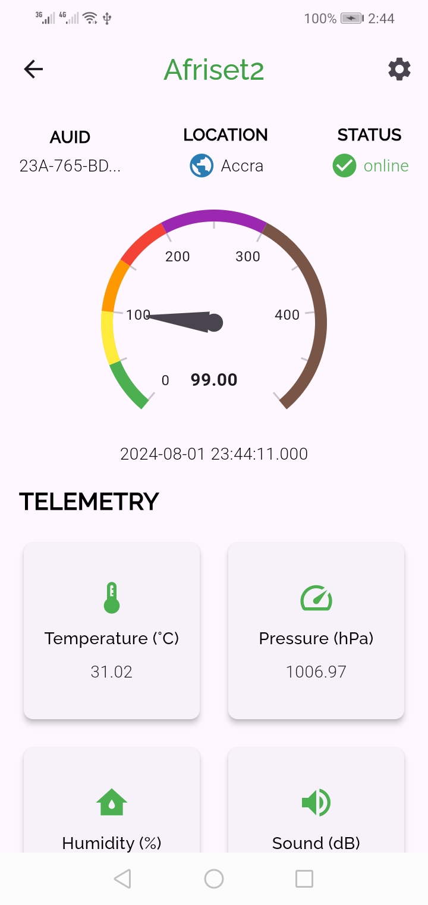
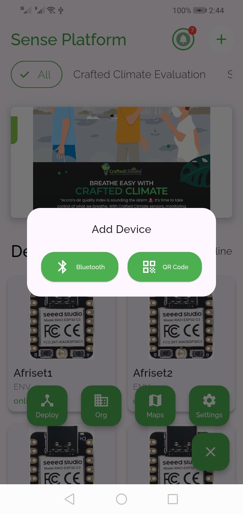

# Crafted Climate

Crafted Climate(Sense Platform Mobi) is a cutting-edge mobile application designed to provide real-time monitoring of air quality and IoT sensors. By leveraging the power of technology, this app aims to offer users a comprehensive view of environmental data, empowering them to track air quality metrics and manage connected IoT devices efficiently. Our mission is to craft a climate-friendly future with technology, making sustainability and environmental awareness accessible to everyone.

## Project Vision

In today's world, climate change and environmental sustainability are pressing concerns. **Crafted Climate** is a visionary project dedicated to addressing these issues through innovative IoT solutions. Our goal is to provide a platform that not only monitors air quality but also acts as a companion for users in making informed decisions for a sustainable future.

With Crafted Climate, we strive to enable communities, organizations, and individuals to contribute to a healthier planet by harnessing the power of IoT technology. Our app serves as a bridge between the digital world and environmental consciousness, fostering a proactive approach to climate change.

## Features

- **Real-Time Air Quality Monitoring**: Gain access to up-to-the-minute air quality information, including critical metrics such as PM2.5, PM10, and AQI (Air Quality Index).

- **Seamless IoT Sensor Integration**: Effortlessly connect and manage IoT sensors to gather valuable environmental data. Monitor temperature, humidity, CO2 levels, and more.

- **Custom Notifications**: Stay informed with notifications about significant changes in air quality or device status. Set personalized alerts for specific metrics.

- **Interactive Data Visualization**: Visualize air quality data through dynamic charts and graphs. Analyze trends and patterns to make informed decisions.

- **Deployment Management**: Organize and manage various sensor deployments with ease. Customize deployment settings and access detailed insights.

- **User-Friendly Interface**: Navigate through the app with an intuitive and modern UI. Enjoy a seamless user experience that enhances engagement.

## Screenshots



### Notifications



### Device Management



## Installation

To install and run this app locally, ensure you have Flutter installed and configured on your machine. Follow these steps:

1. **Clone the repository:**

   ```bash
   git clone https://github.com/Arnold208/craftedclimate.git
   cd craftedclimate
